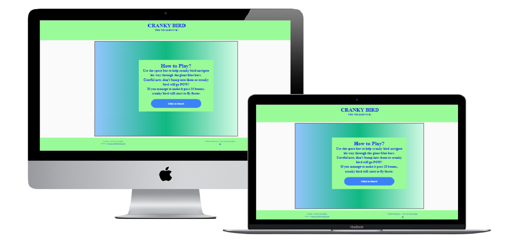

# Cranky Bird 

The live website can be found [here](https://dylanocallaghan.github.io/Milestone2/)

## Purpose

This website was based on an assignment for the Code Institute's Full Stack Developer course. For our second Milestone Project we were tasked with the creation of a game using JavaScript. The game was created based on information provided in the HTML, CSS, User Centric Design, JavaScript Fundamentals and Interactive Frontend Development modules. A full list of technologies used can be found in the [technologies](#Technologies) section of this document.

## Table of Contents
* [User Experience Design (UX)](#User-Experience-Design)
    * [The Strategy Plane](#The-Strategy-Plane)
        * [User stories](#User-Stories)
    * [The Scope Plane](#The-Scope-Plane)
    * [The Structure Plane](#The-Structure-Plane)
    * [The Skeleton Plane](#The-Skeleton-Plane)
        * [Wireframes](#Wireframes)
    * [The Surface Plane](#The-Surface-Plane)
        * [Design](#Design)
            * [Colour Scheme](#Colour-Scheme)
            * [Typography](#Typography)
            * [Imagery](#Imagery)
    * [Differences to Design](#Differences-to-Design)
- [Actions](#Actions)
    * [Existing Actions](#Existing-Actions)
    * [Future Actions](#Actions-Left-to-Implement)
* [Technologies](#Technologies)
* [Testing](#Testing)
    * [Test Strategy](#Test-Strategy)
    * [Test Results](#Test-Results)
    * [Isses and Resolutions](#Issues-and-Resolutions-to-issues-found-during-testing)
* [Deployment](#Deployment)
    * [GitHub Pages](#Using-Github-Pages)
    * [Locally](#Run-Locally)
* [Credits](#Credits)
  * [Code](#Code)
  * [Acknowledgements](#Acknowledgements)

****

## User Experience Design
### **The Strategy Plane**
The strategy behind the creation of this website focuses on a dual purpose. The first ambition was to illustrate my knowledge of HTML, CSS & JavaScript. The second ambition was to provide users with an entertaining and increasingly challenging game created with JavaScript. The end result is an online game called "Cranky Bird". The game created is easy to understand, interactive and gives performance-based feedback to the user on a desktop. This game was not created for mobile devices because you must use the space bar to fly up and down.

Site Goals:
* To demonstrate the skills I have learnt in HTML, CSS, JavaScript.
* To create an aesthetically pleasing game that is visually satisfying to the user.
* To provide users with relatively simple interactive game with clear Win / Lose outcomes.
* To create an enjoyable game that challenges the user and makes the user want to stay and play again.
* To create a game that makes the user want to return to the website.
* To create a game that increases in difficulty based on user performance to ensure the objective remains interesting to the user and does not become repetitive.

#### User stories
* As a user, I want to easily understand the main purpose of the site.
* As a user, I want to view the website and content clearly on my computer.
* As a user, I want to have instructions on how to play the game so that I can understand the rules.
* As a user, I want to be able to start a game when I am ready.
* As a user, I want to see a bird fly up and down.
* As a user, I want to know when my bird hits a barrier.
* As a user, I want an effortless way to begin a new game when the current game has ended.
* As a user, I want to see my score so that I know how many obstacles I have successfully evaded.
* As a user, I want the site owner's contact information to be readily available in the event that I need to reach out with a site-related query.
* As a user, I want to see other work the site owner has created using their GitHub profile / repositories.

### **The Scope Plane**
Actions planned:
* Page Heading: A page heading or caption that clearly defines what the page is about.
* An interactive Cranky Bird game: visible on screen is a backdrop of trees and mountains, a blue bird wearing a hat, a multicoloured trail issuing from the bird as it flies, and large blue bars for the bird to navigate.
* Game Instructions: Clear, concise instructions on how to play the game, visible to the user before they start the game.
* Start Button.
* Score Count.
* Score displayed at end game.
* Restart Game button.
* Appearance of Game Over message.
* Footer Items - Contact Information and link GitHub Profile / Repository.

**Action Importance/Effort**  

### **The Structure Plane**

User Story:
> As a user, I want to easily understand the main purpose of the site.
 
 Acceptance Criteria:
* Header displayed with text 'Cranky Bird'
* Sub heading displayed with text 'Try to survive!'

Description: 
There will be a page heading added that reads 'Cranky Bird' with the tag line 'Try to survive!' below it. This will enable the users to gain an immediate overview and understanding of the site purpose when they enter.

User Story:
> As a user, I want to view the website and content clearly on my computer.
 
 Acceptance Criteria:
 * Website layout is well displayed and readable on a desktop device.

Description: 
Bootstrap will be used to lay the content of the website out in containers, rows and columns. No elements should overlap their containers and all items should be responsive so that no elements are too large to display properly. 

The colours should be coordinated for maximum clarity and to ensure they are appealing to the user.

User Story:
> As a user, I want to have instructions on how to play the game so that I can understand the rules.
 
 Acceptance Criteria:
 * Game Instructions are provided that contain the following information:
    * How to interact with the game.
    * How to lose the game.
    * Any additional features that the user should be aware of, e.g. speed increasing when I pass a certain level.

Description: 
Information to be included:
A full set of game instructions will be added as a modal to make sure it can be read before the game begins. This will provide the user with information on how to control the bird, how the speed of the game increases and how the user might lose the game. 
If the bird touches an obstacle the bird will explode and a visual 'POW!' will appear. 
If the user loses the game, the score will be appear on-screen to ensure the user is aware of their end score. 
Only a space bar input will be accepted to manoeuvre the character up and down. 

User Story:
> As a user, I want to be able to start a game when I am ready.
 
 Acceptance Criteria:
 * User can initiate start game.

Description: 
A button will be added to the "How to play" modal to allow the user to start a game.

User Story:
> As a user, I want to see a bird fly up and down.
 
 Acceptance Criteria:
 * When the space bar is pressed the character will go upwards and it will have a natural velocity downwards.

Description: 
The bird will fall downwards on the screen unless spacebar is pressed in which case it will go upwards.

User Story:
> As a user, I want to know when my bird hits a barrier.
 
 Acceptance Criteria:
 * A death modal will appear if the character's hitbox enters the obstacles area.

Description: 
If the user is successful in avoiding an obstacle, the score will increase and the game will continue. 
If the user is unsuccessful in avoiding an obstacle, the game will end and a modal will appear with the user's score and a 'play again' button.

User Story:
> As a user, I want an effortless way to begin a new game when the current game has ended.
 
 Acceptance Criteria:
 * User has a way to restart the game by the end game modal. This function will reset the whole game.

Description: 
A button will be added to the end game modal that will refresh the game, create a  new game with new obstacles and reset the game at the original gamespeed.

User Story:
> As a user, I want to see my score so that I know how many obstacles I have successfully evaded.
 
 Acceptance Criteria:
 * User score displayed on screen upon game over

Description: 
A score will be added to the page to show the user how many obstacles they have avoided during their session. This score will only be displayed for the current session. Once the game is reset, the score will reset for a new game.

User Story:
> As a user, I want the site owner's contact information to be readily available in the event that I need to reach out with a site-related query.
 
 Acceptance Criteria:
 * Contact information displayed in footer.

Description: 
Contact information will be added to the footer; this will include the name and email address of the site owner.

User Story:
> As a user, I want to see other work the site owner has created using their GitHub profile / repositories.
 
 Acceptance Criteria:
 * GitHub Repository information is included.
 * GitHub Icon featured that directs the user to the site owner's GitHub Profile.

Description: 
The site owner's GitHub Repository information will be included in the footer. This should contain the site owner's GitHub username. It will also feature a GitHub icon, when the user clicks on this icon they will be directed to the owner's GitHub page.

### **The Skeleton Plane**
#### Wireframes
Desktop view

### **The Surface Plane**
### Design

#### Colour Scheme
Body colour: White 
Text colour: Blue  
Game Board background colour: Multicoloured  
Header and Footer background: A light green #98FB98 

#### Typography
All of the text within the body is in the font "Times", this includes all modals and buttons.

#### Imagery
The image of the bird was taken from OpenGameArt.org and the image was made into a sprite using codeandweb.com.

#### Differences to Design

All actions listed in the Scope Plane were implemented as per design.

****
## Actions

### Existing Actions

* Heading and Sub-heading.
* Game Instructions.
* Scorecount.
* Spacebar input.
* Buttons to start and re-start game.
* Footer - Contact Information and GitHub Repository Information

### Actions Left to Implement

* Levels: 'Easy' and 'Hard' mode will be added in a future release. The easy mode will be at a slow speed with a greater distance between obstacles, giving the user a higher chance of making it past the obstacles. The hard mode will start with a faster speed, the obstacles will also be closer together to provide the user with a more challenging experience.

****
## Technologies
* [HTML](https://en.wikipedia.org/wiki/HTML)
	* HTML is the main language used to complete the structure of the website.
* [CSS](https://en.wikipedia.org/wiki/CSS)
	* Custom written CSS is used in this project to style the website.
* [JavaScript](https://en.wikipedia.org/wiki/JavaScript)
	* JavaScript is used for functionality throughout the website; this applies to both the Cranky Bird game and the onclick button functions.
* [Bootstrap](https://getbootstrap.com/)
	* The Bootstrap framework is used throughout the website for layouts and styling. 
* [Gitpod](https://gitpod.io/workspaces)
	* Gitpod is used to develop the website.
* [GitHub](https://github.com/)
	* The source code for the website is stored in the hosting site GitHub. [Git Pages](https://pages.github.com/) is used for the deployment of the live site.
* [Git](https://git-scm.com/)
	* Git is used as version control software to commit and push code to the GitHub repository (i.e. the storage location of the source code).
* [Figma](https://www.figma.com/file/7ic47sIHwTefP0dWBJdFzB/Untitled?node-id=0%3A1)
	* The wireframes for 'The Skeleton Plane' stage of UX design were created using Figma.
* [Favicon](https://favicon.io/)
    * Favicon.io was used to make the site favicon. 
* [Techsini](http://techsini.com/multi-mockup/index.php)
    * tecnisih.com Multi Device Website Mockup Generator was used to create the mockup image in this README.
* [Excel](https://www.microsoft.com/en-ie/microsoft-365/excel)
    * Excel was used to create the bar chart illustrating difficulty / importance information.

****
## Testing

### Test Strategy
#### **Summary**

As part of the Milestone Project 2, testing must be carried out on The Cranky Bird game. All actions and user stories documented in the README must be tested. 

HTML code must pass through the [W3C HTML Validator](https://validator.w3.org/).

CSS code must pass through the [W3C CSS Validator](https://jigsaw.w3.org/css-validator/).

JavaScript code must pass through the [JSHint Validator](https://jshint.com/).

#### **High Level Test Cases**

User Stories covered:
* As a user, I want to view the website and content clearly on my computer. - TC001, TC002, TC003
* As a user, I want to easily understand the main purpose of the site. - TC004
* As a user, I want to have instructions on how to play the game so that I can understand the rules. - TC005
* As a user, I want to be able to start a game when I am ready. - TC008
* As a user, I want an effortless way to begin a new game when the current game has ended. - TC008
* As a user, I want to know when my bird hits a barrier. - TC007
* As a user, I want to see my score so that I know how many obstacles I have successfully evaded. - TC010
* As a user, I want the site owner's contact information to be readily available in the event that I need to reach out with a site-related query. - TC013
* As a user, I want to see other work the site owner has created using their GitHub profile / repositories. - TC014

#### **Access Requirements**

GitHub Repository must be set to public for the live website to appear.

#### **Regression Testing**

Any actions that were previously tested while in development should be retested on the live website.

#### **Assumptions and Dependencies**

Testing is dependent on website being live on GitHub pages.

#### **Out of Scope**

The only testing that will be performed as part of this test effort is the testing listed under High Level Test Cases.

### Test Results

 
Complete test results can be found [here](assets/MS2-test-results.xlsx) 
Please note these results are a .xlsx file and will require excel, google docs or another compatible program to open the file. 
All tests passed; a few minor warnings appeared when validating the codes.

### Issues and Resolutions to issues found during testing
* I was initially going to create a game similar to "Breakout" but I discovered that when you changed the desktop size it would change the coordinate system. This meant that you couldn't fire the pellet in some directions. I couldn't find a resolution to this so I decided to change the game type I was going to create.
* Email link was broken due to a space between the mailto and email. This was found when running code through jshint.com and was fixed by removing the space.
* Clicking on the screen would multiply the game speed because it was constantly running the animate() function. This issue was found using jshift, and was fixed by ensuring the animate() function runs when you click on the start button.
* The restart button wasn't working properly, when you pressed it the speed did not reset, it would keep the previous game's speed. This meant an increased starting speed if the user had made it to 20 plus score in the previous game. It was fixed by creating a second button that refreshes the page to reset the game.
* Game speed wasn't increasing when the user hit 20 points. This issue was fixed by using "if ((score%20) === 0)" to divide by 20 and thus to recognise the marker to increase the speed of the game.
****
## Deployment

### Using Github Pages
1. Navigate to the GitHub [Repository](https://github.com/dylanocallaghan/Milestone2)
1. Click the 'Settings' Tab.
1. Scroll down to the Git Hub Pages Heading.
1. Select 'Master Branch' as the source.
1. Click the 'Save' button.
1. Click on the link to take you to the live deployed page.

### Run Locally
1. Navigate to the GitHub [Repository](https://github.com/dylanocallaghan/Milestone2)
1. Click the code drop down menu.
1. Either download the ZIP file, unpackage locally and open with IDE (This route ends here) OR Copy Git URL from the HTTPS dialogue box.
1. Open your preferred development editor and open a terminal window in a directory of your choice.
1. Use the 'git clone' command in terminal followed by the copied git URL.
1. A clone of the project will be created locally on your machine.

****
## Credits

### Code
The JavaScript used to create this HTML canvas game was inspired by different YouTube videos such as [youtube link](https://www.youtube.com/watch?v=eI9idPTT0c4). In addition, YouTube videos helped with the development of the start and restart buttons. Phaser was also used to help develop various aspects of the game and to stimulate game ideas [phaser](http://phaser.io/).

### Acknowledgements
I would like to thank Slack user Spence_mentor for his help and pointers throughout this project. Spence_mentor helped me with a range of problems, for example, resolving an issue with the restart button. Additionally, Spence_mentor offered guidance and support on how I could ensure the game ran more efficiently.
****